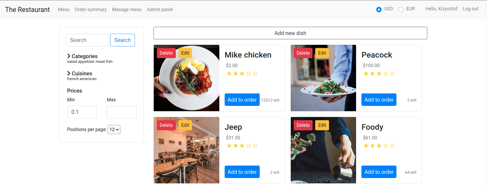

# Restaurant Web App

Projekt na WDAI 2021/2022. Restauracja zamawianie jedzenia.

## Setup
- Node v16.19.0 
- npm v8.19.3
- Angular CLI 12.2.13

Add .env file with `DB_CONNECTION_URI` and `ACCESS_TOKEN_KEY`.

Run `npm install`

## Run Development

`ng serve` for frontend
Runs on http://localhost:4200/ by default

`node server.js` for backend
Runs on http://localhost:8080/ by default

